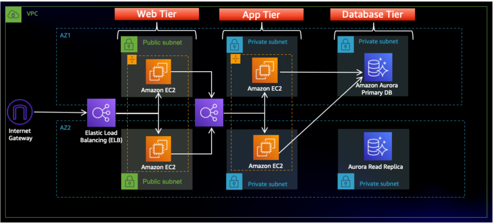

🚀 Project Overview
This project demonstrates a fully functional 3-tier application deployed on AWS, emphasizing scalability, reliability, and security. It includes a web tier (frontend), an application tier (backend), and a database tier, all configured for high availability and fault tolerance.

Architecture Diagram
The following diagram illustrates the 3-Tier Architecture implemented in this project:

☁️ AWS Services Used
VPC (Virtual Private Cloud): For isolated network environments.

S3 (Simple Storage Service): To store application code and configurations.

IAM (Identity and Access Management): For secure access control to AWS resources.

EC2 (Elastic Compute Cloud): Virtual servers for the web and application tiers.

RDS (Relational Database Service): Managed relational database (Amazon Aurora) for the database tier.

ELB (Elastic Load Balancing): For distributing traffic across instances in both web and application tiers (Internal and External Load Balancers).

Route 53: For domain mapping and DNS resolution.

SSL Certificate: For secure HTTPS communication.

🛠️ Getting Started
To set up and run this project, follow the steps below.

1. Fork and Clone the Repository
First, fork this repository to your GitHub account and then clone it to your local machine:

git clone https://github.com/KastroVKiran/3TierArchitectureApp.git
cd 3TierArchitectureApp

2. AWS Infrastructure Setup
2.1. VPC Creation
Design and create a Virtual Private Cloud (VPC) with public and private subnets across multiple Availability Zones (AZs) to serve as the foundation for the project infrastructure.

2.2. S3 Bucket and IAM Role Setup
Create an S3 bucket to store your application code. Upload the application-code/web-tier/ and application-code/app-tier/ contents, along with the nginx.conf and nginx-Without-SSL.conf files, to a designated folder in your S3 bucket (e.g., s3://<S3 Bucker Name>/application-code/).

Set up an IAM role with the necessary S3 read permissions and attach it to the EC2 instances that will host the web and application tiers.

2.3. Database Configuration (RDS)
Launch and configure an RDS instance (e.g., Amazon Aurora MySQL-compatible) in a private subnet to serve as the backend database.

Update DbConfig.js:
Navigate to application-code/app-tier/DbConfig.js in your local cloned repository and update the database credentials:

module.exports = Object.freeze({
    DB_HOST: 'YOUR-DATABASE-ENDPOINT.ap-south-1.rds.amazonaws.com', // Replace with your RDS endpoint
    DB_USER: 'admin',       // Your database username
    DB_PWD: 'kastro2025',   // Your database password
    DB_DATABASE: 'webappdb' // Your database name
});

This configuration allows your App Servers in private subnets to connect to the database. After updating, upload this modified DbConfig.js file to the app-tier folder in your S3 bucket.

Configure MySQL Database on App Tier EC2 instances:
Connect to the EC2 instances in your application tier and install MySQL client:

sudo yum install mysql -y

Connect to your RDS database instance:

mysql -h <DB EndPoint> -u admin -p

Enter your DB password (e.g., kastro2025). If connection fails, check the Security Group rules for your RDS instance to ensure it allows inbound traffic from your application tier's security group.

Create the database and a table:

CREATE DATABASE webappdb;
USE webappdb;
CREATE TABLE IF NOT EXISTS transactions(
  id INT NOT NULL AUTO_INCREMENT,
  amount DECIMAL(10,2),
  description VARCHAR(100),
  PRIMARY KEY(id)
);
INSERT INTO transactions (amount, description) VALUES ('400', 'groceries');
SELECT * FROM transactions;
exit;

2.4. Application Tier Setup (EC2 and Internal Load Balancer)
On your Application Tier EC2 instances:

Install Node.js and PM2:

curl -o- https://raw.githubusercontent.com/avizway1/aws_3tier_architecture/main/install.sh | bash
source ~/.bashrc
nvm install 16
nvm use 16
npm install -g pm2

Download application code from S3:

cd ~/
sudo aws s3 cp s3://<S3BucketName>/application-code/app-tier/ app-tier --recursive
cd app-tier/
npm install

Start the application with PM2:

pm2 start index.js
pm2 save
pm2 startup

Verify application health:

curl http://localhost:4000/health
# Expected output: "This is the health check"

Create an Internal Load Balancer:
Set up an internal Application Load Balancer (ALB) to distribute traffic across your application tier EC2 instances. Ensure it targets port 4000 for your Node.js application.

Update nginx.conf (for Web Tier):
Locally, open the nginx.conf file (from the application-code/ directory in the cloned repo). Update the location /api/ block to proxy requests to your internal ALB's DNS name:

        #proxy for internal lb
        location /api/ {
                proxy_pass http://[REPLACE-WITH-INTERNAL-LB-DNS]:80/;
        }

Replace [REPLACE-WITH-INTERNAL-LB-DNS] with the actual DNS name of your Internal Application Load Balancer. After updating, upload this modified nginx.conf file to the S3 bucket to be used by the web tier.

2.5. Web Tier Setup (EC2 and External Load Balancer)
On your Web Tier EC2 instances:

Switch to ec2-user (if needed) and navigate to home directory:

sudo -su ec2-user
cd /home/ec2-user

Install Node.js and NVM:

curl -o- https://raw.githubusercontent.com/avizway1/aws_3tier_architecture/main/install.sh | bash
source ~/.bashrc
nvm install 16
nvm use 16

Download web-tier application code from S3:

aws s3 cp s3://<S3 Bucker Name>/application-code/web-tier/ web-tier --recursive
cd web-tier
npm install
npm run build

Install Nginx:

sudo amazon-linux-extras install nginx1 -y

Update Nginx configuration:

cd /etc/nginx
sudo rm nginx.conf
sudo aws s3 cp s3://<S3 Bucker Name>/application-code/nginx.conf . # Copies the nginx.conf with internal LB DNS
sudo service nginx restart

Set permissions and enable Nginx on boot:

chmod -R 755 /home/ec2-user
sudo chkconfig nginx on

Create an External Load Balancer:
Provision an external Application Load Balancer (ALB) to manage incoming traffic from users, targeting your web-tier EC2 instances on port 80.

2.6. SSL Certification and Domain Mapping
Generate an SSL certificate (e.g., using AWS Certificate Manager) and apply it to the external load balancer to ensure secure HTTPS communication.

Map your domain name to the external load balancer's DNS name using AWS Route 53 for public accessibility.

Verify the Web Application:
Once all configurations are complete and DNS propagation has occurred, paste the public IP address of your Web-Tier-Instance (or your domain name if Route 53 is configured) into your browser. You should see the application, ready for data entry.

🗑️ Cleanup
To avoid incurring unnecessary AWS costs, remember to delete all provisioned resources in the following order:

Auto Scaling Groups (ASG)

Both Load Balancers (External and Internal)

Both Target Groups (TGs)

Both AMIs (Amazon Machine Images)

Both Snapshots of AMIs

RDS Database

S3 Bucket

SSL Certificate

Route 53 record

NAT Gateway

Elastic IP (associated with NAT Gateway)

VPC
